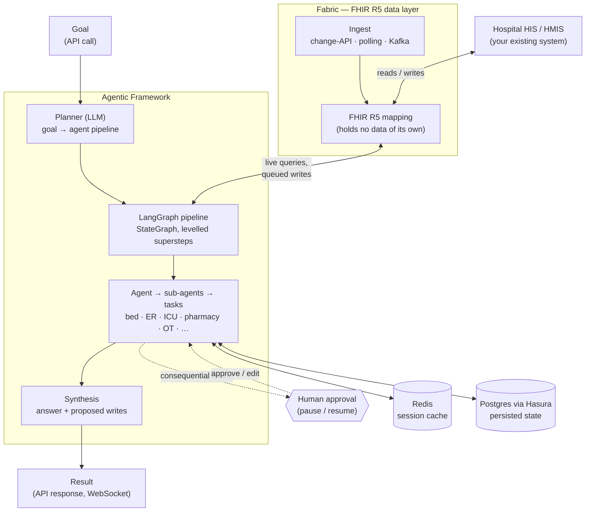

# Hospilot

**The open-source Agentic AI Operating Layer for Hospital Operations.**

Hospitals already have a HIS/HMIS. What they don't have is something that *acts* on it.
Hospilot sits on top of your existing hospital information system, reads what's actually
happening across beds, ER, ICU, staffing, and revenue in real time, and coordinates
purpose-built AI agents to plan and execute the operational work a human would otherwise
have to piece together by hand — with a human approving every consequential step.

[](./LICENSE)

---

## Why Hospilot?

Most hospital software is built to *record* what happened. Almost none of it is built to
*decide what to do next* — that's still a person mentally joining five screens together
under time pressure: is a bed actually free, is staffing enough to safely take a patient,
will the ICU still have capacity if someone deteriorates tonight.

Hospilot is the layer that does that joining for you, continuously, and turns it into
coordinated action instead of a report you have to interpret yourself:

- **Ask it, don't query it.** "Can we safely take this patient into the respiratory ward
  tonight?" is a real input — an LLM planner turns a goal like that into a pipeline of the
  specific agents needed to answer it, not a fixed report.
- **Agents that act, not just summarize.** Bed reservations, staffing reallocation, billing
  reviews — proposed as concrete actions, gated behind human approval by default.
- **Built on your data, not a copy of it.** Hospilot never owns clinical data. Everything
  flows live through [Fabric](./fabric), a FHIR R5 translation layer that reads and writes
  through your existing HIS's own APIs.
- **Human-in-the-loop by construction**, not bolted on. Approval is a pause in the actual
  execution graph — the workflow durably waits, not a side-channel notification you might
  miss.

---

## Architecture



This repo contains **Fabric** and the **Agentic Framework**, end to end and runnable on
their own. Fabric ingests your HIS data through whichever mode it exposes — a change API,
polling, or Kafka — and maps it to FHIR R5, never storing clinical data itself. A goal comes
in over the API, the planner turns it into an agent pipeline, agents read and write through
Fabric while checking state in Redis/Postgres, and any consequential action pauses for human
approval before it executes. Results come back the same way the goal came in — how you
trigger that call and render the result is entirely up to you.

---

## What you can build

- **Natural-language hospital operations queries** — ask a question, get an answer grounded
  in your actual live data, not a canned report.
- **Autonomous multi-agent workflows** — bed management, ER triage and routing, ICU capacity
  and step-down planning, staffing/nurse-ratio checks, pharmacy and lab prioritization, OT
  scheduling, discharge planning, billing and revenue review, all coordinated as one pipeline
  when a goal touches more than one domain.
- **New domain agents** — the agent manifest system (`agents/_shared/manifest.py`) declares
  exactly what data an agent may touch; adding a new one is a scoped, guardrailed addition,
  not a fork of the planner.
- **A FHIR-native integration for a new HIS** — swap what Fabric talks to upstream; the
  agents never need to know which hospital system is on the other end.

---

## Demo

> 🎬 *A 60–90 second walkthrough goes here — a surge predicted in the ER, the bottleneck
> traced through ICU/bed/staffing, agents proposing coordinated action, a human approving
> it. Coming soon.*

---

## Quick Start

Requires **Python 3.11+** and **Docker**. This brings up Kafka, Fabric, Redis, and the
agentic-framework backend:

```bash
git clone git@github.com:Carer-Healthcare-AI/Hospilot.git
cd Hospilot
cp agentic-framework/.env.example agentic-framework/.env    # fill in HASURA_* and ANTHROPIC_API_KEY
cp fabric/.env.example fabric/.env
docker compose -f deployments/docker-compose.fabric.yml \
               -f deployments/docker-compose.agentic-framework.yml up --build
```

Then open `http://localhost:8000/docs` (agentic-framework) and `http://localhost:8002/docs`
(Fabric) — every route is documented there.

**One real prerequisite this doesn't hand you:** a Postgres database with Hasura GraphQL in
front of it, reachable via `HASURA_URL` / `HASURA_ADMIN_SECRET`. Neither compose file above
includes it yet (tracked in the [Roadmap](#roadmap)) — point them at your own Hasura
instance, apply `agentic-framework/schemas/sql/hospilot_schema.sql`, and you're running the
full pipeline end to end. Without Hasura configured, planning and agent execution will fail
at the first data read.

Want just one service? [`agentic-framework/README.md`](./agentic-framework/README.md) and
[`fabric/README.md`](./fabric/README.md) both have a plain `pip install` + `uvicorn` path
with no Docker at all.

---

## Hospital use cases

- **ER surge** — a wave of arrivals hits; is triage keeping up, and where do admissions go
  from here?
- **ICU capacity crunch** — a ward patient is deteriorating; is there a real ICU bed, and
  who steps down to make room if not?
- **Hospital-wide bed gridlock** — nothing's technically "full," but nothing's moving either
  — where's the actual bottleneck?
- **Discharge delays** — beds that are clinically ready to turn over but stuck on paperwork,
  transport, or a pending order.
- **Nurse staffing shortfalls** — a shift is short-handed; is the float pool enough, and
  where does it need to go?
- **Pharmacy bottlenecks** — STAT medications, critical-patient priority, and
  substitution/availability checks that need to clear before discharge or a next dose.
- **OT/theatre utilization** — is today's schedule slipping, and where's the delay coming
  from — staff, equipment, or an emergency case bumping the queue?
- **Revenue leakage** — claims sitting in a state that's quietly heading toward denial.

---

## Agent architecture

One goal becomes one graph. Every request follows the same path from prompt to action:

```
  user goal
     │
     ▼
  PLANNER (LLM)                 workflows/planner.py
     │   picks which agents are needed and wires them into a DAG
     ▼
  PIPELINE  →  LangGraph StateGraph          workflows/graph/builder.py
     │   one node per agent, levelled so a whole level runs in one superstep
     ▼
  AGENT node                    workflows/graph/agents/*, agents/<domain>/
     │   selects sub-agents, each sub-agent runs one or more TASKS
     ▼
  TASK                          agents/_shared/*, workflows/unified_executor.py
     │   builtin, or LLM-generated from a data *schema* and run sandboxed
     ▼
  SYNTHESIS  →  answer + proposed writes (queued through Fabric)
```

**Agent catalog** — fourteen domain agents ship in this cut (`agentic-framework/agents/`):

| Agent | Does |
|---|---|
| `bed_agent` | Bed availability, status, ranking, reservations, dirty-bed recovery |
| `er_agent` | ER queue management, triage scoring, admission and fast-track routing |
| `icu_agent` | ICU census, ventilator tracking, transfer ranking, step-down candidate identification |
| `staff_agent` | Nurse–patient ratios, float-pool availability, shift staffing levels |
| `discharge_agent` | Discharge readiness, barrier tracking, discharge summary generation |
| `pharmacy_agent` | Medication prioritization, prescription/dispensing validation, drug availability, controlled-substance checks |
| `lab_agent` | Sample prioritization, STAT handling, analyzer routing/utilization, turnaround-time tracking |
| `ot_agent` | OT/theatre scheduling, delay prediction, staff coordination, slot optimization |
| `housekeeping_agent` | Vacated-bed cleaning dispatch and tracking |
| `revenue_agent` | Billing-gap & leakage review, profitability, denial-risk prediction |
| `billing_agent` | Patient invoice lookup and bill generation |
| `ambulance_agent` | Ambulance assignment and dispatch coordination |
| `patient_verification_agent` | Incoming-patient identity verification and unknown-patient registration |
| `appointment_agent` | OPD appointment scheduling, doctor-slot matching, patient reminders/escalation |

Full technical detail — the planner, the sandboxed task-codegen model, checkpointing,
the policy engine — is in [`agentic-framework/README.md`](./agentic-framework/README.md).

### Example AI queries

```
"Can the respiratory ward safely take an incoming isolation patient tonight?"
"What's our bed availability across all wards right now?"
"Are we short-staffed on any shift in the next 12 hours?"
"Which pending claims have the highest denial risk this week?"
"If ICU gets one more critical admission tonight, do we have a step-down candidate?"
"Which patients are discharge-ready but stuck on pending labs or documentation?"
"Is OT running behind schedule today, and where's the bottleneck?"
```

---

## Integrations

| | |
|---|---|
| **Data / interop** | FHIR R5, Kafka |
| **Storage** | PostgreSQL (via Hasura), Redis |
| **Orchestration** | LangGraph, Temporal (optional, off by default) |
| **LLM** | Anthropic Claude, or any OpenAI-compatible endpoint (e.g. local Ollama) |
| **Deploy** | Docker / Docker Compose |

---

## Roadmap

- [ ] One-command Docker Compose that includes Postgres + Hasura, so Quick Start has zero
      external prerequisites
- [ ] Further domain agents — infection control, supply chain
- [ ] Natural-language Q&A over live hospital data, open-sourced
- [ ] Multi-agent negotiation for cross-domain conflicts (e.g. bed vs. staffing tradeoffs)
- [ ] Simulation / what-if mode for testing a proposed action before approving it

> This list reflects real gaps found while writing this README, not a committed release
> plan — check [Discussions](../../discussions) for what's actually in progress.

---

## Contributing

See [`CONTRIBUTING.md`](./CONTRIBUTING.md) for local setup, coding guidelines, and how to
add a new agent. Issues labeled `good first issue` are a good place to start.

---

## Community

Questions, use cases, and proposed agents/integrations are all welcome as
[Issues](../../issues) or [Discussions](../../discussions) — whether you're a developer, a
hospital ops team, or a healthcare-AI researcher.

---

## License

MIT — see [`LICENSE`](./LICENSE). Use it, fork it, run it in production, build a competing
product with it; the only ask is the copyright notice stays attached.

---

If Hospilot is useful to you, **starring the repo** is the single easiest way to help more
hospitals and developers find it. ⭐
